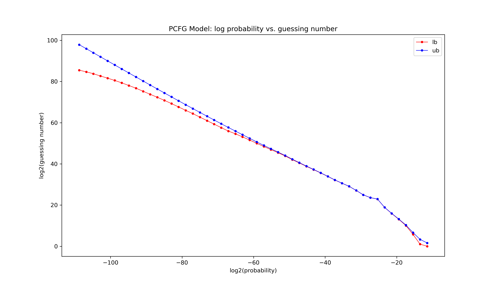
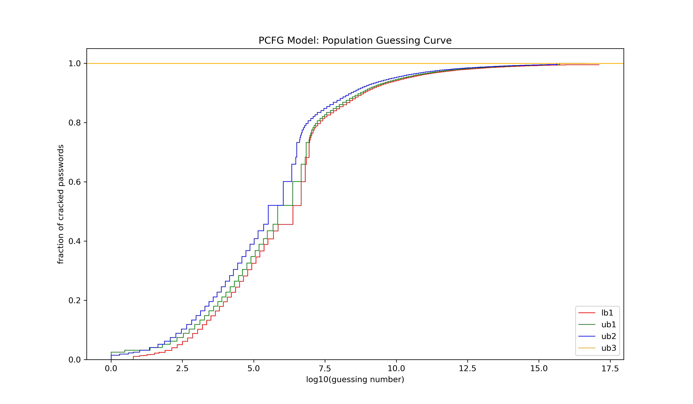
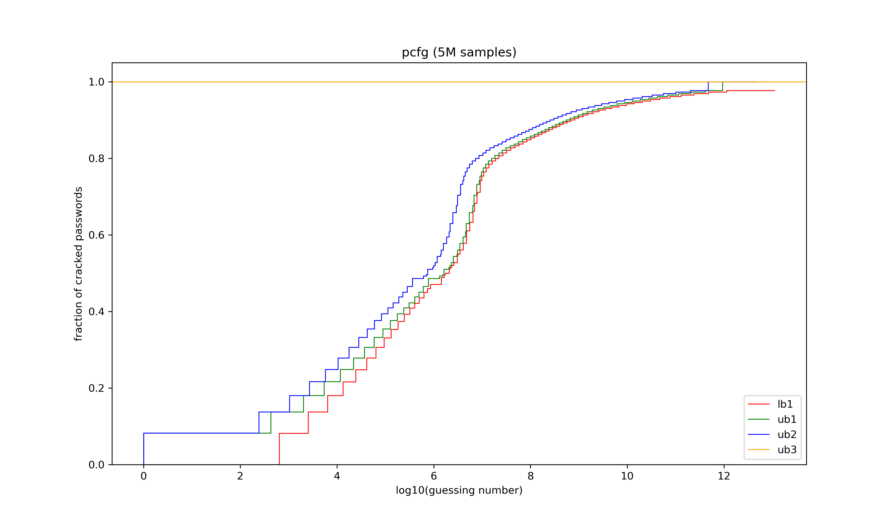
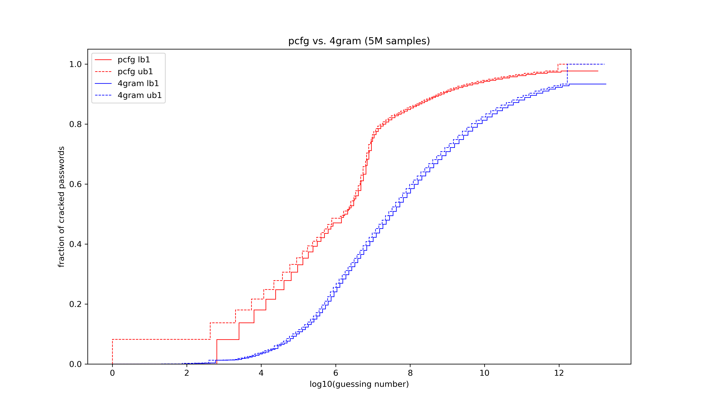

This is a walkthrough of how a user might utilize the Confident Monte Carlo library.

### The Simple Interface

The code is available in [simple.py](simple.py).

First, import the necessary files. `cmc.py` is the main file containing the Confident Monte Carlo interface, `password_guessing_model.py` is for accessing the PCFG model described in the paper, and `math` is only for the `log` function.

    import math
    import password_guessing_model as pgm
    from cmc import ConfidentMonteCarlo

Then, instantiate the password guessing model `mod` using the password file `testset.txt`. With the password guessing model `mod` and the dataset `testset.csv`, instantiate the `ConfidentMonteCarlo` object `cmc`.

    mod = pgm.PCFGModel('./dataset/testset.txt')
    cmc = ConfidentMonteCarlo(mod, './dataset/testset.csv')

Now we are ready to perform analysis on the password model and dataset! Use the method `guesssing_number_bound()` to bound the guessing numbers of individual passwords (i.e. $G(pwd)$).

    print(cmc.guessing_number_bound('Password123', 0.01))
    print(cmc.guessing_number_bound(math.log2(1e-15), 0.01))

The results are `(614974, 629366)` and `(6920612035829, 7982644650999)`. Indicating that we are 99% sure that the guessing number under the model of the password `'Password123'` is between 614974 and 629366. Formally, $\Pr[614973 \leq G(pwd) \leq 629366] \geq 0.99$. Similarly, the second result indicates that we are 99% sure that the guessing number under the model of a password with probability $10^{-15}$ under the model is between 6920612035829 and 7982644650999, or formally, $\Pr[6920612035829 \leq G(10^{-15}) \leq 7982644650999] \geq 0.99$

Use the method `guessing_number_plot()` to visualize the relationship between the log probability of passwords and their guessing number under the model.

    cmc.guessing_number_plot(0.01, 'PCFG Model: log probability vs. guessing number', './plots/pcfg_guessing_number_plot.png')

The method call creates the plot:

Use the method `dataset_guessing_curve_bound()` to bound the guessing curves of the password model (i.e. $\lambda_{M,B,D}$).

    print(cmc.dataset_guessing_curve_bound(1e7, 0.01))

The result is (0.75022, 0.76518), indicating that we are 99% confident that the percentage of passwords that will be cracked within 10000000 guesses from the model is between 75.022% and 76.518%. Formally, $\Pr[0.75022 \leq \lambda_{M,B,D} \leq 0.76518] \geq 0.99$, where $M$ is the PCFG model `mod`, $B=10^7$, and $D$ is the password dataset `testset.csv`.

Finally, use the method `population_guessing_curve_plot()` to visualize the entire guessing curve on the population (i.e. $\lambda_{M,B}$). The bounds in the plot all hold with probability at least 0.99.

    cmc.population_guessing_curve_plot(0.01, 'PCFG Model: Population Guessing Curve', './plots/pcfg_guessing_curve.png')

The method call creates the plot.

### Advanced Tools

The code is available in [advanced.py](advanced.py)

First, import the necessary files

    import math
    import matplotlib.pyplot as plt
    import password_guessing_model as pgm
    from cmc import ConfidentMonteCarlo, MeshPointGenerator

Then, specify the models to be analyzed as well as a mesh point generator. Here, `cmc1` is for a PCFG model and `cmc2` is for a 4gram model. Both models are trained with the password file `dataset/testset.txt` and analyzed with the password dataset `dataset/testset.csv`.

    mod1 = pgm.PCFGModel('./dataset/testset.txt')
    cmc1 = ConfidentMonteCarlo(mod1, './dataset/testset.csv')
    mod2 = pgm.NGramModel('./dataset/testset.txt', 4)
    cmc2 = ConfidentMonteCarlo(mod2, './dataset/testset.csv')

    mpg = MeshPointGenerator()

Note that the user also has the option to specify a password policy to enforce, such as `cmc3` here. The policy `pol` requires that the password is of length at least 6 and contains both a digit and an uppercase letter.

    def pol(pwd): # length > 6 and contains digit and uppercase letter
        return len(s) >= 6 and any(c.isdigit() for c in s) and any(c.isupper() for c in s)
    mod3 = pgm.PCFGModel('./dataset/testset.txt')
    cmc3 = ConfidentMonteCarlo(mod3, './dataset/testset.csv', pol)

To start with, draw 5 million samples with both models, and group the samples into 2500 groups. Note that the number of samples and the number of groups can be tuned by the user based on the specific model used (our recommendation is that the user choose a number of groups such that the number of groups and the number of samples in each group is about the same to get a good lower bound, although experiments do show that the optimal `n` value depends on the model).

    samples1 = cmc1.sample(5000000)
    cmc1.group_sample(2500)
    samples2 = cmc2.sample(5000000)
    cmc2.group_sample(2500)

The methods `hoeffding_bound()` and `markov_lowerbound()` give bounds for individual passwords.

    print(cmc1.hoeffding_bound(math.log2(1e-7), 0.01))
    print(cmc2.markov_lowerbound(math.log2(1e-13), 0.01))

The results are `((455190, 468763), (455190, 468763))` and `(95339302773, 95339302773)`. This means that we are 99% confident that, for an attacker using the pcfg model and a password with probability $10^{-7}$, the exclusive guessing number is above 455190 and below 486763 and the inclusive guessing number is also above 455190 and below 468763 (note that the bounds are the same for exclusive and inclusive guessing numbers, indicating that there are no passwords with probability exactly 1e-8). Formally, $\Pr[G^{EX}(10^{-7}) \geq 455190] \geq 0.99$, $\Pr[G^{EX}(10^{-7}) \leq 468763] \geq 0.99$, $\Pr[G^{IN}(10^{-7}) \geq 455190] \geq 0.99$, and $\Pr[G^{IN}(10^{-7}) \leq 486763] \geq 0.99$. For the 4gram model, the guessing number of a password with probability 1e-15 can be lower-bounded by 95339302773 with 99% confident. Formally, $\Pr[G(10^{-15}) \geq 95339302773] \geq 0.99$.

For the guessing curve of the pcfg model, first generate a set of 100 mesh points using the samples drawn from the model with the `from_sample()` method provided in the `MeshPointGenerator` class. Then, use the `fit()` method call to specify the mesh points as well as the desired error rate. 

    mesh = mpg.from_sample(samples1, 100, math.log2(1e-14))
    cmc1.dataset_curve_bound_fit(mesh, 0.01) # note: user can also fit seperately with different mesh points and error rates
    print(cmc1.dataset_curve_bound1_query(1e8))
    dataset_curves_1 = cmc1.dataset_curve_bound_plot(savename='./plots/pcfg_dataset_curve_bound.png', title='pcfg (5M samples)')

The result of `query()` is `(0.84902, 0.85866)` , indicating that the fraction of passwords in the dataset that will be cracked within $10^8$ guesses is above 0.593 (99% confidence) and below 0.611 (99% confidence). Formally, $\Pr[0.84902 \leq \lambda_{M,B,D} \leq 0.85866] \geq 0.99$, where $M$ is the PCFG model `mod1`, $B=10^8$, and $D$ is the dataset in `dataset/testset.csv`. The `plot()` function generates the figure below and returns the values that generate the plot for the user to plot more complicated figures.

The `plot()` method call creates the image:

The process of getting the guessing curve for the population is similar to getting that of the dataset, just with different `fit()` and `query()` methods.

    cmc1.population_curve_bound1_fit(mesh, 0.005, 0.005)
    cmc1.population_curve_bound2_fit(mesh, 0.005, 0.005)
    cmc1.population_curve_bound3_fit(0.01)
    print(cmc1.population_curve_bound2_query(1e10))
    population_curves_1 = cmc1.population_curve_bound_plot(savename='./plots/pcfg_population_curve_bound.png', title='pcfg (5M samples)')

The result of `query()` is 0.95440, which means that we are 99% confident that an attacker using the 4-gram model would crack no more than 95% of the passwords in the population within $10^{10}$ guesses. Formally, $\Pr[\lambda_{M,B} \leq 0.95440] \geq 0.99$, where $M$ is the 4-gram model `mod2` and $B=10^{10}$.

The `plot()` method call creates the image:

Lastly, to compare the guessing curves of different models or model parameters, the user can use the dictionary returned from the `plot()` methods.

    mesh = mpg.from_sample(samples2, 100, math.log2(1e-14))
    cmc2.dataset_curve_bound_fit(mesh, 0.01)
    dataset_curves_2 = cmc2.dataset_curve_bound_plot()

    fig, ax = plt.subplots()
    ax.stairs(dataset_curves_1['lb1'][0], dataset_curves_1['lb1'][1], linewidth=0.8, baseline=None, label='pcfg lb1', color='red', linestyle='solid')
    ax.stairs(dataset_curves_1['ub1'][0], dataset_curves_1['ub1'][1], linewidth=0.8, baseline=None, label='pcfg ub1', color='red', linestyle='dashed')
    ax.stairs(dataset_curves_2['lb1'][0], dataset_curves_2['lb1'][1], linewidth=0.8, baseline=None, label='4gram lb1', color='blue', linestyle='solid')
    ax.stairs(dataset_curves_2['ub1'][0], dataset_curves_2['ub1'][1], linewidth=0.8, baseline=None, label='4gram ub1', color='blue', linestyle='dashed')
    ax.set_xlabel('log10(guessing number)')
    ax.set_ylabel('fraction of cracked passwords')
    ax.set_title('pcfg vs. 4gram (5M samples)')
    ax.legend()
    fig.set_size_inches(12, 7)
    fig.savefig('pcfg_v_4gram', dpi=300)

